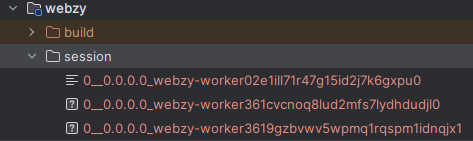
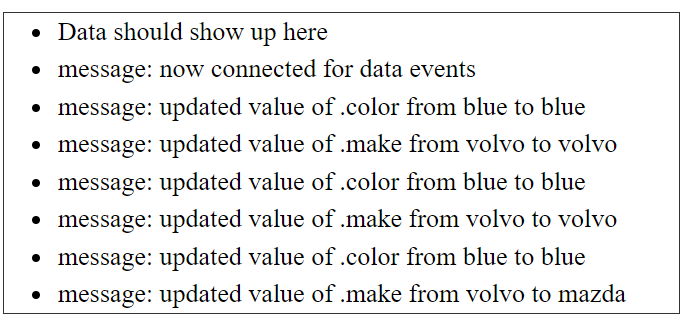
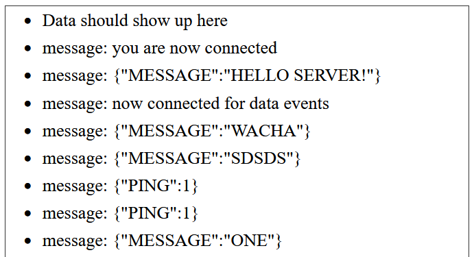
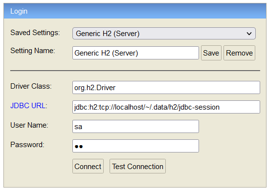
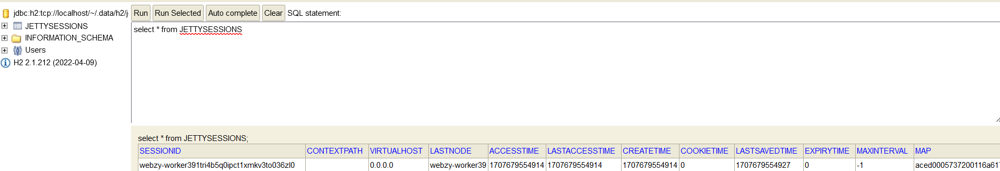
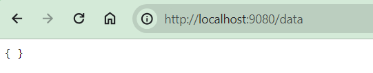
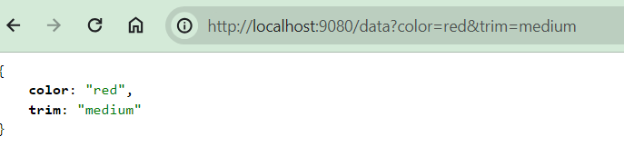
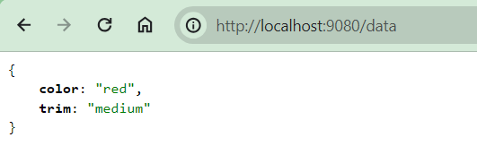
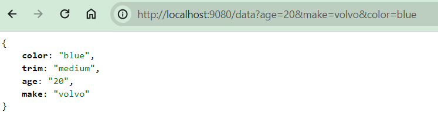

# Building on the existing knowledge

## Phase 1

Bootstrap a barebone server, with just a tcp connector and a resource handler

```java
public static Server createServer(int port) {
    Server server = new Server();
    HttpConfiguration httpConfig = new HttpConfiguration();
    httpConfig.setSendServerVersion(false);
    HttpConnectionFactory http11 = new HttpConnectionFactory(httpConfig);
    try (ServerConnector connector = new ServerConnector(server, http11)) {
        connector.setPort(port);
        server.setConnectors(new Connector[]{connector});
    }
    return server;
}
```

Create a barebone servlet

```java
public class SessionDemo extends HttpServlet {

    @Override
    protected void doGet(HttpServletRequest req, HttpServletResponse resp) throws ServletException, IOException {
        resp.setStatus(200);
        resp.getWriter().println("success");
    }
}
```

Fire up the server and verify that the Servlet is reachable

```java
public static void main(String[] args) throws Exception {
    int port = 9080;
    String resourceRoot = "C:\\Projects\\java\\reactive\\webzy\\www";
    Server server = createServer(port);

    // servlet resource context handler
    ServletContextHandler context = new ServletContextHandler();
    context.setContextPath("/");
    context.setBaseResource(Resource.newResource(resourceRoot));
    context.setWelcomeFiles(new String[]{"index.html"});

    // add and configure default servlet
    ServletHolder defaultHolder = context.addServlet(DefaultServlet.class, "/");
    defaultHolder.setInitParameter("dirAllowed", "false");
    defaultHolder.setInitParameter("gzip", "true");

    // add demo servlet
    ServletHolder sessionHolder = context.addServlet(SessionDemo.class, "/sess");
    sessionHolder.setInitParameter("sessionDir", sessionDir.toString());

    // start server
    server.setHandler(context);
    server.start();
}
```

Fire up a _curl_ request

```bash
curl http://localhost:9080/sess

#output
success
```

The next step will be to configure the session handler.

Configure a session id manager

```java
public static SessionIdManager configureSessionIdManager(Server server) throws Exception {
    //There is a maximum of one SessionIdManager per Server instance.
    DefaultSessionIdManager idMgr = new DefaultSessionIdManager(server);
    idMgr.setWorkerName("webzy-worker" + LocalDateTime.now().getSecond());
    server.setSessionIdManager(idMgr);

    //There is a maximum of one HouseKeeper per SessionIdManager
    HouseKeeper houseKeeper = new HouseKeeper();
    houseKeeper.setSessionIdManager(idMgr);
    //set the frequency of scavenging cycles
    houseKeeper.setIntervalSec(600L);
    idMgr.setSessionHouseKeeper(houseKeeper);
    return idMgr;
}
```

Configure a session cache factory

```java
public static DefaultSessionCacheFactory addDefaultSessionCacheFactory(Server server) {
    // There is one SessionCache per SessionHandler, and thus one per context.
    DefaultSessionCacheFactory cacheFactory = new DefaultSessionCacheFactory();
    //EVICT_ON_INACTIVE: evict a sess after 60sec inactivity
    cacheFactory.setEvictionPolicy(SessionCache.NEVER_EVICT);
    //Only useful with the EVICT_ON_INACTIVE policy
    //cacheFactory.setSaveOnInactiveEvict(true);
    cacheFactory.setFlushOnResponseCommit(true);
    cacheFactory.setInvalidateOnShutdown(false);
    cacheFactory.setRemoveUnloadableSessions(true);
    cacheFactory.setSaveOnCreate(true);
    server.addBean(cacheFactory);
    return cacheFactory;
}
```

Configure a data index factory

```java
    public static FileSessionDataStoreFactory addFileSessionCacheFactory(Server server, File dir) {
    //  There is one SessionDataStore per SessionCache. One file represents one sess in one context.
    FileSessionDataStoreFactory storeFactory = new FileSessionDataStoreFactory();
    storeFactory.setStoreDir(dir);
    storeFactory.setGracePeriodSec(3600);
    storeFactory.setSavePeriodSec(0);
    server.addBean(storeFactory);
    return storeFactory;
}
```

Pull together all the _SessionHandler_ plumbing in one function

```java
public static SessionHandler configureSessionHandler(Server server, File dir) throws Exception {
    SessionHandler sessionHandler = new SessionHandler();
    // default config
    sessionHandler.setHttpOnly(true);
    sessionHandler.setSecureRequestOnly(true);
    sessionHandler.setSameSite(HttpCookie.SameSite.STRICT);
    // custom config
    sessionHandler.setSessionIdManager(configureSessionIdManager(server));
    sessionHandler.setSessionCache(addDefaultSessionCacheFactory(server).newSessionCache(sessionHandler));
    sessionHandler.getSessionCache().setSessionDataStore(addFileSessionCacheFactory(server, dir).getSessionDataStore(sessionHandler));
    return sessionHandler;
}
```

Update the _Main_ file to reel in a _SessionHandler_ and add it to the _ServletContextHandler_

```java
public static void main(String[] args) throws Exception {
    int port = 9080;
    String resourceRoot = "C:\\Projects\\java\\reactive\\webzy\\www";
    Server server = createServer(port);

    // configure sess factories
    Path sessionDir = Path.of(System.getProperty("user.dir"), "webzy/sess");
    SessionHandler sessionHandler = configureSessionHandler(server, sessionDir.toFile());

    // servlet context
    ServletContextHandler context = new ServletContextHandler(server, "/");
    context.setSessionHandler(sessionHandler);
    context.setBaseResource(Resource.newResource(resourceRoot));
    context.setWelcomeFiles(new String[]{"index.html"});

    // the rest is the same as before
}
```

Update the servlet to take advantage of session handling

```java
public class SessionDemo extends HttpServlet {

    @Override
    protected void doGet(HttpServletRequest req, HttpServletResponse resp) throws ServletException, IOException {
        String[][] choices = Arrays.stream(Objects.requireNonNullElse(req.getQueryString(), "expecting parameters in the query string")
                .split("&")).map(m -> m.split("=")).toArray(String[][]::new);
        int len = Optional.of(choices).map(q -> q.length).orElse(0);
        HttpSession session = req.getSession(true);
        JNode preferences = (JNode) session.getAttribute(PREFERENCES);
        if (preferences == null) {
            preferences = new JObject();
            session.setAttribute(PREFERENCES, preferences);
        }
        if (len > 1) {
            for (String[] pair : choices) {
                preferences.putItem(pair[0], pair[1]);
            }
        }
        resp.setStatus(200);
        resp.getWriter().println(preferences);
    }

    @Override
    protected void doPut(HttpServletRequest req, HttpServletResponse resp) throws ServletException, IOException {
        JNode preferences = JReader.fromJson(req.getInputStream());
        HttpSession session = req.getSession(true);
        session.setAttribute(PREFERENCES, preferences);
        preferences.putItem("mood", "happy");

        resp.setStatus(200);
        resp.getWriter().println(preferences);
    }
}
```

Restart the server and fire up a _curl_ request again

```bash
curl http://localhost:9080/sess

#output
Preferences(color=red, size=XL, brand=volvo)
```

The response now contains the user preference configured by default.
Now, pass color in the query string to see the response changing

```bash
curl http://localhost:9080/sess?color=green
Preferences(color=green, size=XL, brand=volvo)
```

The configured _sessionDir_ folder should now also contain some files



## Phase 2

Phase 1 looks good, and in the meantime, it will be put on ice. Now moving onto the next phase, which is working on the
data servlet

This will make use of _SSE_ (on the server-side with htp2 to
overcome [http1 pipelining issues](https://en.wikipedia.org/wiki/HTTP_pipelining))
in conjunction with _EventSource_ (on the client-side) to form a conduit of channeling changes in backend data to the
frontend without manually
fetching the data

## The backend data index

This data index is initialized by sending a json object to the backend through the __PUT__ method of the data servlet
endpoint.
This json can be manipulated (set, get, delete) by sending json snippets which will be overlaid onto the data already
existing
and cached in the backend session (remember phase 1?).

```java
public class EventsServlet extends HttpServlet {

    final DataEvents observer;
    JNode preferences;

    public EventsServlet(DataEvents observer) {
        this.observer = observer;
    }

    @Override
    protected void doGet(HttpServletRequest req, HttpServletResponse resp) throws ServletException, IOException {
        AsyncContext async = req.startAsync();
        async.start(() -> {
            if (Objects.requireNonNull(req.getHeader("accept"), "Expected an 'Accept' header").contains("text/event-stream")) {

                resp.setHeader("Content-Type", "text/event-stream");
                resp.setHeader("Cache-Control", "no-index");
                resp.setHeader("Connection", "keep-alive");
                resp.setCharacterEncoding("UTF-8");
                resp.setStatus(200);
                try {
                    PrintWriter out = resp.getWriter();
                    observer.setOut(out);
                    observer.write("connected", "now connected for data events");
                } catch (IOException e) {
                    async.complete();
                    throw new RuntimeException(e);
                }
            }
        });
    }

    protected void doPut(HttpServletRequest req, HttpServletResponse resp) throws ServletException, IOException {
        if (preferences == null) {
            preferences = JReader.fromJson(new StringReader("{}"));
            preferences.setObserver(observer);
        }
        String[][] choices = Arrays.stream(Objects.requireNonNullElse(req.getQueryString(), "expecting parameters in the query string")
                .split("&")).map(m -> m.split("=")).toArray(String[][]::new);
        int len = Optional.of(choices).map(q -> q.length).orElse(0);
        if (len > 0) {
            for (String[] pair : choices) {
                preferences.putItem(pair[0], pair[1]);
            }
        }

        resp.setStatus(200);
        resp.getWriter().println(preferences);
    }
}
```

The __GET__ method of the same data servlet endpoint will initiate a __server-sent events__ connection with the browser,
and will
push data whenever this change is detected in the __JNode preferences__ object. This changes made to the data will be
detected by
the __DataEvents__ observer.

From a developer perspective, the only development effort required to achieve this is to create an _Observer_ (in this
case, _DataEvents_
is the observer) to determine exactly what will be transmitted back the the client. In this illustration, we have 4
events of interest.

- set
- get
- delete

These events will be used in the client to accept the corresponding event written to the socket

```java

@Setter
@Getter
public class DataEvents implements Observer {

    PrintWriter out;

    @Override
    public void set(Object target, String path, String key, Object oldValue, Object newValue) {
        write("set", String.format("updated value of %s.%s from %s to %s", path, key, oldValue, newValue));
    }

    @Override
    public void get(Object target, String path, String key, Object value) {
        write("get", String.format("retrieved value '%s' from %s.%s", value, path, key));
    }

    @Override
    public void delete(Object target, String path, String key, Object value) {
        write("delete", String.format("deleted value '%s' from %s.%s", value, path, key));
    }

    @Override
    public void write(String event, String data) {
        out.write(String.format("event: %s\n", event));
        out.write(String.format("data: %s\n\n", data));
        out.flush();
        System.out.println("writing data event to - " + String.format("%s: %s (%d)", event, data, System.identityHashCode(out)));
    }
}
```

Additional plumbing will be required to connect the _EventsServlet_ to the server. This is accomplished by configuring a
new
__ServletContextHandler__

```java
public static ServletContextHandler configureEventsSource(Server server, String ctx) {
    ServletContextHandler context = new ServletContextHandler(server, ctx);

    //add new data events listener
    ServletHolder dataEventsHolder = new ServletHolder();
    dataEventsHolder.setServlet(new EventsServlet(new DataEvents()));
    dataEventsHolder.setInitOrder(0);
    dataEventsHolder.setAsyncSupported(true);
    context.addServlet(dataEventsHolder, "/*");
    return context;
}
```

Since the server no has more than one __ServletContextHandler__, the handlers assigned to the server needs to be
adjusted

```bash
# same as previous

// configure event source
ServletContextHandler sseContext = configureEventsSource(server, "/sse");
        
// start server
ContextHandlerCollection contexts = new ContextHandlerCollection();
contexts.addHandler(context);
contexts.addHandler(sseContext);
server.setHandler(contexts);
server.start();
```

And remember that making that connection to the backend will now make use of http2, and for that, some adjustment will
be needed as well

```java
public static Server createServer(int port) {
    Server server = new Server();
    HttpConfiguration httpConfig = new HttpConfiguration();
    httpConfig.setSendServerVersion(false);
    HttpConnectionFactory http11 = new HttpConnectionFactory(httpConfig);
    // The ConnectionFactory for clear-text HTTP/2.
    HTTP2CServerConnectionFactory h2c = new HTTP2CServerConnectionFactory(httpConfig);
    // The ALPN ConnectionFactory.
    ALPNServerConnectionFactory alpn = new ALPNServerConnectionFactory();
    // The default protocol to use in case there is no negotiation.
    alpn.setDefaultProtocol(http11.getProtocol());

    try (ServerConnector connector = new ServerConnector(server, http11, h2c, alpn)) {
        connector.setPort(port);
        connector.setIdleTimeout(TimeUnit.HOURS.toMillis(1));
        server.setConnectors(new Connector[]{connector});
    }
    return server;
}
```

## The frontend data display

In isolation, the backend changes made so far will not have any visible effect on the frontend. For this, there is a
need to connect
to the backend through the _EventSource_ object in javascript.

```js
const evtSource = new EventSource("/sse", {
    withCredentials: false
});

evtSource.onmessage = (event) => {
    addMessageLine(event);
    console.log(evtSource.readyState)
};

evtSource.addEventListener('connected', event => {
    addMessageLine(event);
    console.log(evtSource.readyState)
});

evtSource.addEventListener('set', event => {
    addMessageLine(event);
    console.log(evtSource.readyState)
});

evtSource.addEventListener('get', event => {
    addMessageLine(event);
    console.log(evtSource.readyState)
});

evtSource.addEventListener('delete', event => {
    addMessageLine(event);
    console.log(evtSource.readyState)
});

evtSource.onerror = function (e) {
    addMessageLine({data: "figure out why this error happened"})
    console.log(evtSource.readyState)
};
```

This is simply listening to named events, and sending them all to an _ordered list_ for display.

```html
<!doctype html>
<html lang="en">
<head>
    <meta charset="UTF-8">
    <meta content="width=device-width, user-scalable=no, initial-scale=1.0, maximum-scale=1.0, minimum-scale=1.0"
          name="viewport">
    <meta content="ie=edge" http-equiv="X-UA-Compatible">
    <title>Data Events Demo</title>
    <link href="favicon.ico" rel="shortcut icon" type="image/x-icon"/>
    <link href="index.css" rel="stylesheet" type="text/css">
    <script src="index.js" type="text/javascript"></script>
</head>
<body>
<ol id="list"></ol>
</body>
</html>
```

At this point, restart the server and fire off some _curl requests_.

```bash
 curl -X PUT "http://localhost:9080/sse/?color=blue&make=mazda"
 
 # output
{color=blue, make=mazda}
```

And the browser will continue to show the data which you are changing. This data could by arbitrary



## Phase 3

Phase 2 looks good, but for completeness, I will illustrate phase 2 using a _WebSocket_ which is really an overkill for
this
illustration example, but someone else might find it useful.

Configure a Websocket handler and attach to the server

```java
public static ServletContextHandler configureWebsocket(Server server, String ctx, Function<String, Object> endpoint) {
    ServletContextHandler context = new ServletContextHandler(server, ctx);

    JettyWebSocketServletContainerInitializer.configure(context, (servletContext, container) -> {
        // Configure default max size
        container.setMaxTextMessageSize(128 * 1024);
        container.setIdleTimeout(Duration.ofMinutes(2));    // this allows you to estimate a ping interval of say 90 seconds on the client side
        // Add websockets
        container.addMapping("^/ws/(.+)$", (upgradeRequest, upgradeResponse) -> {
            upgradeResponse.setAcceptedSubProtocol("protocolOne");

            // Retrieve the Regex template (other templates are ServletPathSpec and UriTemplatePathSpec).
            RegexPathSpec pathSpec = (RegexPathSpec) upgradeRequest.getServletAttribute(PathSpec.class.getName());

            // Match the URI template.
            Matcher matcher = pathSpec.getPattern().matcher(upgradeRequest.getRequestPath());
            String id = "0";
            if (matcher.find()) {
                id = matcher.group(1);
            }

            return endpoint.apply(id);
        });
    });
    return context;
}
```

The illustration here is a simple generic Websocket endpoint, which as an exercise, you can extend to do the same thing
and the
EventsServlet

```java

@Slf4j
public class EventsEndpoint extends WebSocketAdapter {

    final String id;

    public EventsEndpoint(String id) {
        this.id = id;
    }

    @Override
    public void onWebSocketConnect(Session sess) {
        super.onWebSocketConnect(sess);
        log.debug("Endpoint connected: {}", sess);
        try {
            sess.getRemote().sendString("you are now connected");
        } catch (IOException e) {
            throw new RuntimeException(e);
        }
    }

    @Override
    public void onWebSocketText(String message) {
        super.onWebSocketText(message);
        log.debug("Received TEXT message: {}", message);

        if (message.toLowerCase(Locale.US).contains("bye")) {
            getSession().close(StatusCode.NORMAL, "Thanks");
        } else {
            //echo back a capitalized message
            try {
                getSession().getRemote().sendString(message.toUpperCase());
            } catch (IOException e) {
                throw new RuntimeException(e);
            }
        }
    }

    @Override
    public void onWebSocketClose(int statusCode, String reason) {
        super.onWebSocketClose(statusCode, reason);
        log.debug("Socket Closed: [{}] {}", statusCode, reason);
    }

    @Override
    public void onWebSocketError(Throwable cause) {
        super.onWebSocketError(cause);
        cause.printStackTrace(System.err);
    }
}
```

Add to the server

```bash
//configure websocket
ServletContextHandler wsContext = configureWebsocket(server, "/events", EventsEndpoint::new);

// start server
ContextHandlerCollection contexts = new ContextHandlerCollection();
contexts.addHandler(context);
contexts.addHandler(wsContext);
contexts.addHandler(sseContext);
server.setHandler(contexts);
server.start();
```

The backend needs to be complemented with some work on the frontend, so complete the data pipeline

```js
startWebSocket();

function startWebSocket() {
    // Create a WebSocket connection.
    const socket = new WebSocket("ws://localhost:9080/events/ws/10", "protocolOne");
    const ping_interval = 90 * 1000; // it's in milliseconds, which equals to 2 minutes
    let interval;

    // Connection opened
    socket.addEventListener("open", (event) => {
        socket.send(JSON.stringify({message: "Hello Server!"}));
        const ping = JSON.stringify({"ping": 1});

        interval = setInterval(() => {
            socket.send(ping);
        }, ping_interval);

        //attach submit listener for form
        document.querySelector("#data-form").addEventListener('submit', e => {
            e.preventDefault();
            socket.send(JSON.stringify({"message": e.currentTarget.name.value}));
            e.currentTarget.name.value = "";
        });
    });

    // Listen for messages
    socket.addEventListener("message", (event) => {
        console.log("Message from server ", event.data);
        addMessageLine(event)
    });

    socket.addEventListener("error", (event) => {
        console.log("error occurred with the socket ", event)
        addMessageLine(event)
    });

    socket.addEventListener("close", (event) => {
        console.log("socket has been closed by the server ", event)
        addMessageLine(event)

        // dispose interval
        clearInterval(interval);
    });
}

function toggleForm(e) {
    document.getElementById("data-form").classList.toggle('hidden')
    let text = e.innerHTML;
    e.innerHTML = text.startsWith("Show") ? "Hide WS Form" : "Show WS Form";
}
```

And the html requires addition of a form

```html

<button onclick="toggleForm(this)" type="button">Show WS Form</button>

<form class="hidden" id="data-form">
    <label>
        <input id="name" name="message"/>
    </label>
    <input type="submit" value="Send"/>
</form>
```

And the list of messages will continue to populate with messages coming from the server



## phase 4 - Saving the session in a database

Using H2 DB

To create a database, start H2's Shell tool and create the database file. To do this, navigate to the _bin_ directory of
your __H2__ installation folder, and follow the prompts. Below is an example for illustration

```bash
java -cp h2-2.1.212.jar org.h2.tools.Shell

Welcome to H2 Shell 2.1.212 (2022-04-09)
Exit with Ctrl+C
[Enter]   jdbc:h2:tcp://localhost/~/.data/todos-db
URL       jdbc:h2:file:~/.data/h2/jdbc-session
[Enter]   org.h2.Driver
Driver
[Enter]   sa
User
Password  Password  >>><
Type the same password again to confirm database creation.
Password  Password  >>><
Connected
Commands are case insensitive; SQL statements end with ';'
help or ?      Display this help
list           Toggle result list / stack trace mode
maxwidth       Set maximum column width (default is 100)
autocommit     Enable or disable autocommit
history        Show the last 20 statements
quit or exit   Close the connection and exit

sql> exit
Connection closed
```

You should now be able to accses this database using any tool/editor of your choice.

Configure a jdbc data factory

```java
public static JDBCSessionDataStoreFactory addJdbcDataStoreFactory(String driver, String url) {
    DatabaseAdaptor databaseAdaptor = new DatabaseAdaptor();
    databaseAdaptor.setDriverInfo(driver, url);
    // databaseAdaptor.setDatasource(myDataSource); // you can set data source here (for connection pooling, etc)
    JDBCSessionDataStoreFactory jdbcSessionDataStoreFactory = new JDBCSessionDataStoreFactory();
    jdbcSessionDataStoreFactory.setDatabaseAdaptor(databaseAdaptor);
    return jdbcSessionDataStoreFactory;
}
```

Proceed to create a jdbc session handler

```java
public static SessionHandler configureJdbcSessionHandler(Server server, String driver, String url) throws Exception {
    SessionHandler sessionHandler = new SessionHandler();
    // default config
    sessionHandler.setHttpOnly(true);
    sessionHandler.setSecureRequestOnly(true);
    sessionHandler.setSameSite(HttpCookie.SameSite.STRICT);
    // custom config
    sessionHandler.setSessionIdManager(configureSessionIdManager(server));
    sessionHandler.setSessionCache(addDefaultSessionCacheFactory(server).newSessionCache(sessionHandler));
    sessionHandler.getSessionCache().setSessionDataStore(addJdbcDataStoreFactory(driver, url).getSessionDataStore(sessionHandler));
    return sessionHandler;
}
```

Wire this new session handler to the server instead

```bash
// configure jdbc data session handler
String driver = "org.h2.Driver";
// use a better method for passing credentials. The usage below should only be used in scenarios like testing
String url = "jdbc:h2:file:~/.data/h2/jdbc-session;USER=sa;PASSWORD=password";
SessionHandler jdbcDataSessionHandler = configureJdbcSessionHandler(server, driver, url);

// servlet context
ServletContextHandler context = new ServletContextHandler(server, "/");
//        context.setSessionHandler(fileDataSessionHandler);
context.setSessionHandler(jdbcDataSessionHandler);
```

If you prefer, you can start an instance of H2 Db, and access the database through a TCP connection instead of locking
the
files up through direct access.

```bash
# view options available to start the server
java -cp h2-2.1.212.jar org.h2.tools.Server -?

# start the server using minimum options (this will bring up the console view in the browser)
java -cp h2-2.1.212.jar org.h2.tools.Server

# change the access usl to use tcp instead of file
String url = "jdbc:h2:tcp://localhost/~/.data/h2/jdbc-session;USER=sa;PASSWORD=password";
```



Fire up the server, and make a curl request to any endpoint using a session

```bash
curl "http://localhost:9080/data?color=red&make=mazda&trim=XL"

# output
{color=red, make=mazda, trim=XL}
```

Now check the database for a new entry



Open a browser tab on the data endpoint



Send a query string with key-value pairs



Restarting the server and accessing the data endpoint should return the object already in session



Updating the session data will add new fields or update existing fields



And that brings us to the end of this phase where there is session data that can be updated, and which is saved in a
database.

## Phase 5—Change data capture

At this point, it should be practical to start asking questions like:

- Is it possible to share session data between two users?
- Is it possible to transmit changes to this data to all the parties who share it?

The first step would be to take advantage of change data capture _(cdc)_ tools that are in existence, and to also use a
database which lends itself easily to change data capture.
Postgres is a good candidate because of its write-ahead transaction log architecture, which allows a connector to
produce a change event for every row-level insert, update, and delete operation that was captured.

To make things easier, I'll use docker to run Postgres without having to install it on the development machine. This
docker instance needs to be configured for cdc.

```bash
docker run -d ^
	--name jdbc-sessions-postgres ^
	-e POSTGRES_PASSWORD=postgres ^
	-e PGDATA=/var/lib/postgresql/data/pgdata ^
	-v C:\\Users\\maina\\.data\\cdc:/var/lib/postgresql/data ^
	-p 5432:5432 ^
	postgres:14-bullseye
```

Set up a dedicated user for use with cdc. To provide a user with replication permissions, define a PostgreSQL role that
has at least the REPLICATION and LOGIN permissions,
and then grant that role to the created user.

```bash
docker exec -it e74053299f57 bash
root@e74053299f57:/# psql -U postgres
psql (14.10 (Debian 14.10-1.pgdg110+1))
Type "help" for help.

postgres=# \d
Did not find any relations.
postgres=# create table jdbcsessions;
postgres=# \c jdbcsessions;
You are now connected to database "jdbcsessions" as user "postgres".
postgres=# CREATE USER replicator WITH REPLICATION LOGIN PASSWORD 'postgres';
CREATE ROLE
postgres=# CREATE DATABASE jdbcsessions;
CREATE
```

One the jdbc session table _(jettysessions)_ has been created, you will need to go back to postgres and grant the
_replicator_ user
permissions on that table

```bash
postgres=# \c jdbcsessions
You are now connected to database "jdbcsessions" as user "postgres".
jdbcsessions=# grant all on jettysessions to replicator;
GRANT
exit
```

Client authentication is controlled by a configuration file, which traditionally is named __pg_hba.conf__ and is stored
in the database cluster's data directory.
This file needs to be adjusted, and
more [details can be found here](https://debezium.io/documentation/reference/2.5/connectors/postgresql.html#postgresql-permissions)

```bash
 apt update && apt install nano
 nano var/lib/postgresql/data/pgdata/pg_hba.conf

# make these additions
local   replication     replicator                          trust
host    replication     replicator  127.0.0.1/32            trust
host    replication     replicator  ::1/128                 trust
 
 # change another file
 nano var/lib/postgresql/data/pgdata/postgresql.con
 
# make these changes
wal_level = logical 
```

