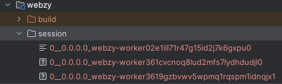

# Building up on the knowledge

Bootstrap a barebones server, with just a tcp connector and a resource handler

```java
public static Server createServer(int port) {
    Server server = new Server();
    HttpConfiguration httpConfig = new HttpConfiguration();
    httpConfig.setSendServerVersion(false);
    HttpConnectionFactory http11 = new HttpConnectionFactory(httpConfig);
    try (ServerConnector connector = new ServerConnector(server, http11)) {
        connector.setPort(port);
        server.setConnectors(new Connector[]{connector});
    }
    return server;
}
```

Create a barebones servlet

```java
public class SessionDemo extends HttpServlet {

    @Override
    protected void doGet(HttpServletRequest req, HttpServletResponse resp) throws ServletException, IOException {
        resp.setStatus(200);
        resp.getWriter().println("success");
    }
}
```

Fire up the server and verify that the Servlet is reachable

```java
public static void main(String[] args) throws Exception {
    int port = 9080;
    String resourceRoot = "C:\\Projects\\java\\reactive\\webzy\\www";
    Server server = createServer(port);

    // servlet resource context handler
    ServletContextHandler context = new ServletContextHandler();
    context.setContextPath("/");
    context.setBaseResource(Resource.newResource(resourceRoot));
    context.setWelcomeFiles(new String[]{"index.html"});

    // add and configure default servlet
    ServletHolder defaultHolder = context.addServlet(DefaultServlet.class, "/");
    defaultHolder.setInitParameter("dirAllowed", "false");
    defaultHolder.setInitParameter("gzip", "true");

    // add demo servlet
    ServletHolder sessionHolder = context.addServlet(SessionDemo.class, "/sess");
    sessionHolder.setInitParameter("sessionDir", sessionDir.toString());

    // start server
    server.setHandler(context);
    server.start();
}
```

Fire up a _curl_ request

```bash
curl http://localhost:9080/sess

#output
success
```

At this point, the _sessionDir_ should be empty, since we are not using any session. Configuring the session handler is
next

Configure a session id manager

```java
public static SessionIdManager configureSessionIdManager(Server server) throws Exception {
    //There is a maximum of one SessionIdManager per Server instance.
    DefaultSessionIdManager idMgr = new DefaultSessionIdManager(server);
    idMgr.setWorkerName("webzy-worker" + LocalDateTime.now().getSecond());
    server.setSessionIdManager(idMgr);

    //There is a maximum of one HouseKeeper per SessionIdManager
    HouseKeeper houseKeeper = new HouseKeeper();
    houseKeeper.setSessionIdManager(idMgr);
    //set the frequency of scavenging cycles
    houseKeeper.setIntervalSec(600L);
    idMgr.setSessionHouseKeeper(houseKeeper);
    return idMgr;
}
```

Configure a session cache factory

```java
public static DefaultSessionCacheFactory addDefaultSessionCacheFactory(Server server) {
    // There is one SessionCache per SessionHandler, and thus one per context.
    DefaultSessionCacheFactory cacheFactory = new DefaultSessionCacheFactory();
    //EVICT_ON_INACTIVE: evict a session after 60sec inactivity
    cacheFactory.setEvictionPolicy(SessionCache.NEVER_EVICT);
    //Only useful with the EVICT_ON_INACTIVE policy
    //cacheFactory.setSaveOnInactiveEvict(true);
    cacheFactory.setFlushOnResponseCommit(true);
    cacheFactory.setInvalidateOnShutdown(false);
    cacheFactory.setRemoveUnloadableSessions(true);
    cacheFactory.setSaveOnCreate(true);
    server.addBean(cacheFactory);
    return cacheFactory;
}
```

Configure a data store factory

```java
    public static FileSessionDataStoreFactory addFileSessionCacheFactory(Server server, File dir) {
    //  There is one SessionDataStore per SessionCache. One file represents one session in one context.
    FileSessionDataStoreFactory storeFactory = new FileSessionDataStoreFactory();
    storeFactory.setStoreDir(dir);
    storeFactory.setGracePeriodSec(3600);
    storeFactory.setSavePeriodSec(0);
    server.addBean(storeFactory);
    return storeFactory;
}
```

Pull together all the SessionHandler plumbing in one function

```java
public static SessionHandler configureSessionHandler(Server server, File dir) throws Exception {
    SessionHandler sessionHandler = new SessionHandler();
    // default config
    sessionHandler.setHttpOnly(true);
    sessionHandler.setSecureRequestOnly(true);
    sessionHandler.setSameSite(HttpCookie.SameSite.STRICT);
    // custom config
    sessionHandler.setSessionIdManager(configureSessionIdManager(server));
    sessionHandler.setSessionCache(addDefaultSessionCacheFactory(server).newSessionCache(sessionHandler));
    sessionHandler.getSessionCache().setSessionDataStore(addFileSessionCacheFactory(server, dir).getSessionDataStore(sessionHandler));
    return sessionHandler;
}
```

Update the _Main_ file to reel in the _SessionHandler_ and add to the _ServletContextHandler_

```java
public static void main(String[] args) throws Exception {
    int port = 9080;
    String resourceRoot = "C:\\Projects\\java\\reactive\\webzy\\www";
    Server server = createServer(port);

    // configure session factories
    Path sessionDir = Path.of(System.getProperty("user.dir"), "webzy/session");
    SessionHandler sessionHandler = configureSessionHandler(server, sessionDir.toFile());

    // servlet context
    ServletContextHandler context = new ServletContextHandler(server, "/");
    context.setSessionHandler(sessionHandler);
    context.setBaseResource(Resource.newResource(resourceRoot));
    context.setWelcomeFiles(new String[]{"index.html"});

    // the rest is the same as before
}
```

Update the servlet to take advantage of session hamdling

```java
public class SessionDemo extends HttpServlet {

    @Override
    protected void doGet(HttpServletRequest req, HttpServletResponse resp) throws ServletException, IOException {
        String[] color = Objects.requireNonNullElse(req.getQueryString(), "expecting a color parameter in the query string").split("=");
        int len = Optional.of(color).map(q -> q.length).orElse(0);
        HttpSession session = req.getSession(true);
        Preferences preferences = (Preferences) session.getAttribute("preferences");
        if (preferences == null) {
            preferences = new Preferences("red", "XL", "volvo");
            session.setAttribute("preferences", preferences);
        }
        if (len > 1) {
            preferences.color = color[1];
        }
        resp.setStatus(200);
        resp.getWriter().println(preferences);
    }
}
```

Restart the server abd fire up a _curl_ request again

```bash
curl http://localhost:9080/sess

#output
Preferences(color=red, size=XL, brand=volvo)
```

Pass color in the query string to see the response change

```bash
curl http://localhost:9080/sess?color=green
Preferences(color=green, size=XL, brand=volvo)
```

The configured _sessionDir_ folder now also has some files



Phase 1 looks good. Now moving onto the next phase.

